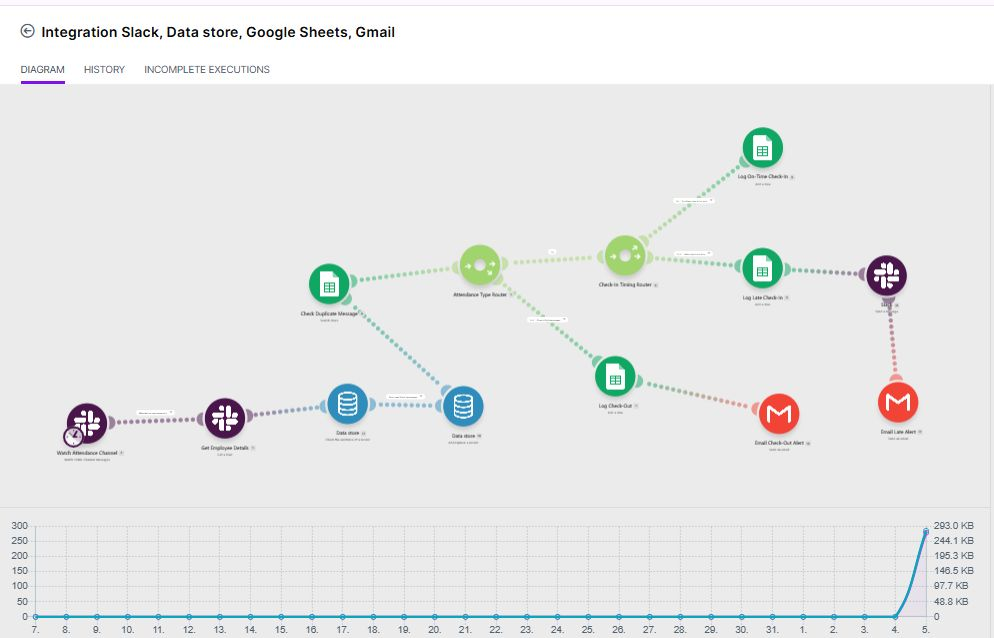

# AI Automation Workflows

Automation workflows I've built with **Make.com**, **Zapier** and other tools, documented so the logic is easy to follow.

---

## 🚀 Slack Attendance Tracking System

An automated system that tracks employee check-ins and check-outs from Slack, with no manual monitoring.

### The Problem
Checking Slack by hand to track who checked in or out, and updating attendance records, was repetitive and time-consuming.

### The Solution
A Make.com scenario that watches attendance messages in Slack and handles everything in the background.

### What It Does
- Monitors attendance messages in Slack
- Identifies whether a message is a **Check-In** or **Check-Out**
- Captures the employee's name, ID, email, date and timestamp
- Checks whether a check-in happened after the deadline
- Sends the employee a **Slack DM** if they are late
- Sends me a **Gmail notification** for late check-ins
- Records all attendance activity in **Google Sheets**
- Records check-out times and sends me an email notification
- Uses duplicate checking so the same Slack message is never processed twice

### Tech Stack
| Tool | Purpose |
|------|---------|
| Make.com | Workflow automation |
| Slack | Attendance messages and late notifications |
| Google Sheets | Attendance records |
| Gmail | Email notifications |
| Make Data Store | Duplicate message checking |

### Result
Attendance is now tracked automatically and works reliably in daily use.

### Key Takeaway
Automation doesn't have to be complicated. A well-designed workflow connecting a few simple tools can save a surprising amount of time.

---

## 🔜 More workflows coming soon

*Note: no company data, employee details or credentials are included in this repository.*
